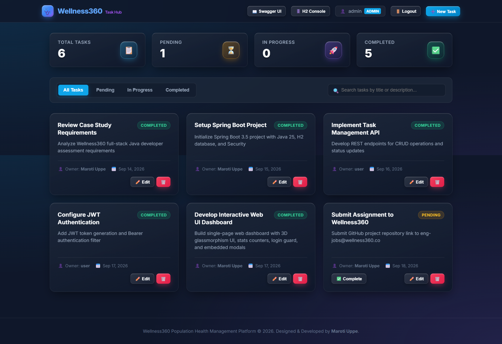

# Wellness360 Task Management System — Full Stack Application

**Author / Developer**: **Maroti Uppe**

A production-ready, full-stack Task Management System built with **Java 25**, **Spring Boot 3.5.0**, **Spring Data JPA**, **H2 File Database**, **JWT Authentication**, and an **Interactive Single-Page Web Dashboard** for the Wellness360 engineering case study.

---

## 🎨 Live Demo & Dashboard Preview



*Figure 1: Single-Page Web Dashboard matching the application design: top header menu (Swagger UI, H2 Console, User Badge, Logout, New Task), real-time statistics counters, live search & filter toolbar, user task owner scoping, and glassmorphism task card grid.*

---

## Table of Contents
1. [Features & Highlights](#features--highlights)
2. [Tech Stack](#tech-stack)
3. [Architecture & Design Decisions](#architecture--design-decisions)
4. [API Endpoints Specification](#api-endpoints-specification)
5. [Prerequisites](#prerequisites)
6. [Build and Test Instructions](#build-and-test-instructions)
7. [Running the Application](#running-the-application)
8. [Web UI Dashboard & Embedded Views](#web-ui-dashboard--embedded-views)
9. [Authentication & User Scoping](#authentication--user-scoping)
10. [Sample cURL Requests](#sample-curl-requests)

---

## Features & Highlights
- **Login-First Single-Page Web UI**: Modern, glassmorphism Web UI dashboard served directly at `http://localhost:9090/`. Unauthenticated visitors see a mandatory Login Guard screen.
- **Embedded Swagger & H2 Modals**: Interactive Swagger UI and H2 Console open directly inside full-screen embedded iframe modals within the UI.
- **User-Scoped Task Management**: Tasks carry an `owner` attribute. Users see their own tasks upon login (`admin` views admin tasks / all tasks; `user` views user tasks).
- **Full RESTful CRUD Operations**: Correct HTTP methods (`GET`, `POST`, `PUT`, `DELETE`, `PATCH`), appropriate HTTP status codes (`200 OK`, `201 Created` with `Location` header, `204 No Content`, `400 Bad Request`, `404 Not Found`).
- **JWT & Basic Authentication**: Secure token generation via `POST /auth/login` and Bearer token filtering.
- **Persistent H2 File Database**: Task data is stored permanently on disk at `./data/taskdb`.
- **Global Error & Validation Handling**: Centrally managed error handling with `@RestControllerAdvice` returning structured `validation_errors`.
- **Automated Tests**: Unit tests with Mockito and REST integration tests with MockMvc.

---

## Tech Stack
- **Language**: Java 25
- **Framework**: Spring Boot 3.5.0 (Spring Web, Spring Data JPA, Spring Security, Validation)
- **Database**: H2 Database (File-based: `./data/taskdb`)
- **Security**: JWT (`jjwt 0.12.6`) + Spring Security
- **API Docs**: Springdoc OpenAPI UI (`2.8.5`)
- **Frontend**: HTML5, CSS3 (Custom Design System), Vanilla JS (Fetch API, SPA Router, Modals, Toast Alerts)
- **Testing**: JUnit 5, Mockito, Spring Security Test, AssertJ

---

## Architecture & Design Decisions

1. **Controller → Service → Repository Pattern**:
   Strict separation of concerns. Controllers handle REST contracts, services execute business logic & validation, and repositories manage JPA data access.
2. **DTO & Entity Isolation**:
   `Task` entity is isolated from `TaskRequestDto` and `TaskResponseDto` to prevent over-posting vulnerabilities and decouple API contracts from the database schema.
3. **Snake Case JSON Naming**:
   Configured `spring.jackson.property-naming-strategy=SNAKE_CASE` in `application.properties` to ensure API JSON fields match `due_date`, `created_at`, `updated_at`, and `owner` as specified in the case study.
4. **Flexible Enum Mapping & Custom Web Converter**:
   `TaskStatus` handles case-insensitive values (`pending`, `in_progress`, `completed`). A custom `Converter<String, TaskStatus>` in `WebConfig` handles URL query parameters seamlessly.
5. **No Reflection/Lombok Compiler Bottlenecks**:
   All entities, DTOs, and controllers feature explicit getters, setters, constructors, and builders for 100% build compatibility with JDK 25.

---

## API Endpoints Specification

| Method | Endpoint | Description | Expected Request Body | Success Code |
| :--- | :--- | :--- | :--- | :--- |
| `POST` | `/auth/login` | Authenticate user & get JWT Token | Username & Password JSON | `200 OK` |
| `GET` | `/tasks` | Retrieve user's tasks (optional `?status=pending`) | None | `200 OK` |
| `GET` | `/tasks/{id}` | Retrieve specific task by ID | None | `200 OK` |
| `POST` | `/tasks` | Create a new task (auto-assigned to user) | Task Request JSON | `201 Created` |
| `PUT` | `/tasks/{id}` | Update existing task | Task Request JSON | `200 OK` |
| `DELETE` | `/tasks/{id}` | Delete task by ID | None | `204 No Content` |
| `PATCH` | `/tasks/{id}/complete` | Mark task status as `completed` | None | `200 OK` |

### Task Entity JSON Schema
```json
{
  "id": 1,
  "title": "Implement Task Management API",
  "description": "Develop REST endpoints for CRUD operations",
  "due_date": "2026-09-14",
  "status": "in_progress",
  "owner": "user",
  "created_at": "2026-09-13T10:30:00",
  "updated_at": "2026-09-13T10:30:00"
}
```

---

## Prerequisites
- **JDK 25** or higher installed (`java -version`)
- **Apache Maven 3.8+** installed (`mvn -version`)

---

## Build and Test Instructions

### 1. Compile project
```bash
mvn clean compile
```

### 2. Run automated unit and integration tests
```bash
mvn test
```

---

## Running the Application

### PowerShell (Windows)
```powershell
$env:JAVA_HOME="C:\Program Files\Java\jdk-25.0.3"; $env:PATH="C:\Program Files\Java\jdk-25.0.3\bin;" + [System.Environment]::GetEnvironmentVariable("PATH","Machine") + ";" + [System.Environment]::GetEnvironmentVariable("PATH","User"); mvn spring-boot:run
```

---

## ☁️ Render Cloud Deployment & CI/CD

The repository includes a production multi-stage [`Dockerfile`](file:///e:/Own-Projects/INTERVIEW/welness360Asignment/Dockerfile), [`render.yaml`](file:///e:/Own-Projects/INTERVIEW/welness360Asignment/render.yaml) blueprint, and [GitHub Actions Workflow](file:///e:/Own-Projects/INTERVIEW/welness360Asignment/.github/workflows/ci-cd.yml) for automated building, testing, and deployment.

### Deployed Application URL Format:
- **Live Production URL**: `https://wellness360-task-manager.onrender.com`
- **Swagger Documentation**: `https://wellness360-task-manager.onrender.com/swagger-ui/index.html`

### Steps to Deploy on Render:
1. Log into [Render.com](https://render.com) and click **New +** → **Blueprint**.
2. Connect your GitHub repository `wellness360-task-manager`.
3. Render automatically detects `render.yaml` and builds the Docker service.

---

## Authentication & User Scoping

The system includes pre-configured demo users:

| Role | Username | Password | Access Scope |
| :--- | :--- | :--- | :--- |
| **Admin** | `admin` | `admin123` | Full access to all tasks & system tasks |
| **User** | `user` | `user123` | Access restricted to `user`-owned tasks |

---

## Sample cURL Requests

### 1. Obtain JWT Token (`POST /auth/login`)
```bash
curl -X POST http://localhost:9090/auth/login \
  -H "Content-Type: application/json" \
  -d '{
    "username": "admin",
    "password": "admin123"
  }'
```

### 2. Create Task (`POST /tasks`)
```bash
curl -X POST http://localhost:9090/tasks \
  -H "Authorization: Bearer <YOUR_JWT_TOKEN>" \
  -H "Content-Type: application/json" \
  -d '{
    "title": "Review Case Study",
    "description": "Submit code to eng-jobs@wellness360.co",
    "due_date": "2026-09-14",
    "status": "pending"
  }'
```

### 3. Get User Tasks (`GET /tasks`)
```bash
curl -X GET http://localhost:9090/tasks \
  -H "Authorization: Bearer <YOUR_JWT_TOKEN>"
```

### 4. Filter Tasks by Status (`GET /tasks?status=completed`)
```bash
curl -X GET "http://localhost:9090/tasks?status=completed" \
  -H "Authorization: Bearer <YOUR_JWT_TOKEN>"
```

### 5. Mark Task Complete (`PATCH /tasks/1/complete`)
```bash
curl -X PATCH http://localhost:9090/tasks/1/complete \
  -H "Authorization: Bearer <YOUR_JWT_TOKEN>"
```

### 6. Delete Task (`DELETE /tasks/1`)
```bash
curl -X DELETE http://localhost:9090/tasks/1 \
  -H "Authorization: Bearer <YOUR_JWT_TOKEN>"
```
